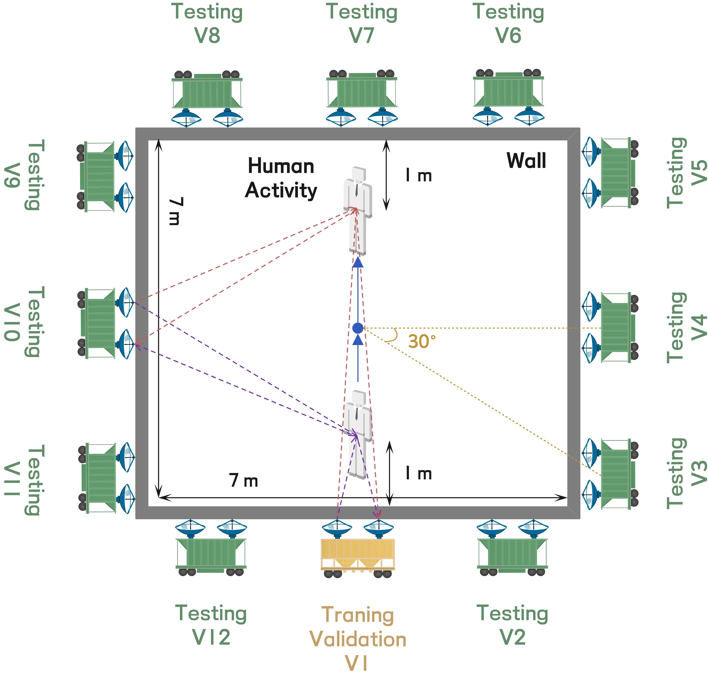

<div align="center">



<h1 style="color:#000000;">Omnidirectional TWR HAR (Multi-Domain Version)</h1>

<p>
  <b>Expanded Multi-Window mDOF Hard Voting Ensemble for Omnidirectional Through-the-Wall Radar Human Activity Recognition</b>
</p>

<kbd>
  <a href="https://www.semanticscholar.org/author/Weicheng-Gao/2051685234">
    
  </a>
</kbd>
&nbsp;&nbsp;
<kbd>
  <a href="https://joeybgofficial.github.io/">
    
  </a>
</kbd>
&nbsp;&nbsp;
<kbd>
  <a href="https://ieeexplore.ieee.org/author/37089574449">
    
  </a>
</kbd>
&nbsp;&nbsp;
<kbd>
  <a href="https://radar.bit.edu.cn/index.htm">
    
  </a>
</kbd>

</div>

---

## 💕 I. Introduction & Overview

**This repository provides a MATLAB implementation of omnidirectional through-the-wall radar human activity recognition based on expanded multi-window horizontal micro-Doppler optical flow and hard voting ensemble learning.**

Through-the-wall radar (TWR) human activity recognition (HAR) is strongly affected by observation orientation. A model trained at one radar view often suffers from severe performance degradation when the same activity is observed from another view. To improve cross-orientation generalization, this work decodes the stored jet-color Doppler-time map (DTM) into normalized log-amplitude intensity and extracts twelve horizontal mDOF maps with different slow-time window lengths and frame intervals.

The current implementation trains one DTM branch and twelve multi-window mDOF branches independently. The final activity label is obtained by hard voting. Branch confidence is used only for tied voting cases. The training and validation data are collected at the 0-degree view, while the trained ensemble is directly evaluated on 30-330-degree measured testing views.

### 📫 Paper Information

* **Title:** None.
* **Journal Reference:** None.

---

## ✅ II. Core Highlights

<table>
  <tr align="center">
    <td width="50%">
      <h3>🧥 1. JetLogDTM-Aware Input</h3>
      <p>The original RGB jet DTM is decoded back to normalized log-amplitude intensity. No second logarithmic transform, no default histogram equalization, and no extra contrast enhancement are applied.</p>
      <br>
    </td>
    <td width="50%">
      <h3>🌠 2. Expanded mDOF Windows</h3>
      <p>Twelve horizontal mDOF maps are extracted with short, middle, long, and near-global slow-time windows to improve branch diversity for cross-view testing.</p>
      <br>
    </td>
  </tr>
  <tr align="center">
    <td>
      <h3>🌀 3. Independent Branch Learning</h3>
      <p>The original DTM and each mDOF map are sent to independent lightweight branch networks, reducing single-feature dependence and encouraging complementary decisions.</p>
      <br>
    </td>
    <td>
      <h3>🚀 4. Hard Voting Ensemble</h3>
      <p>The final label is produced by hard voting across selected branches. Tied cases are resolved by branch confidence and a fixed DTM-to-mDOF priority order.</p>
      <br>
    </td>
  </tr>
</table>

---

## 🛠️ III. How to Install

This repository is fully developed in MATLAB. No Python, CUDA, or external deep-learning framework is required.

### 🔧 Part 1: Prepare MATLAB Environment

Suggested environment:

> (1) MATLAB R2025b or later.<br>
> (2) Image Processing Toolbox.<br>
> (3) Computer Vision Toolbox.<br>
> (4) Deep Learning Toolbox.<br>
> (5) Parallel Computing Toolbox is optional and can be used for process-based feature-cache acceleration when available.

Download or clone the whole repository, then open MATLAB and enter the repository root folder:

```matlab
cd("Your_Path/Omnidirectional-Through-the-Wall-Radar-Human-Activity-Recognition-Multi-Domain-Version-main");
```

### 🗂️ Part 2: Prepare Dataset Folders

The repository supports both the simulated dataset and measured real-world dataset. Please put them directly under the repository root folder with the following exact names:

```text
Omnidirectional_TWR_HAR_Multi_Domain/
|-- Multi-View_RWSet/
|-- Multi-View_SimHSet/
|-- Functions/
|-- Visualization/
|-- Main_Train_Omnidirectional_TWR_HAR_mDOF_GAF.m
|-- Main_Infer_New_DTM.m
```

The measured dataset should be named `Multi-View_RWSet` and organized as:

```text
Multi-View_RWSet/
|-- Multi-View_RW_Training_and_Validation_Set/
|   |-- Bodyrotating/
|   |-- Empty/
|   |-- Falling to Walking/
|   |-- Grabbing/
|   |-- Kicking/
|   |-- Punching/
|   |-- Sitting Down/
|   |-- Sitting to Walking/
|   |-- Standing Up/
|   |-- Walking/
|   |-- Walking to Falling/
|   |-- Walking to Sitting/
|
|-- Multi-View_RW_Testing_Set/
|   |-- 30/
|   |-- 60/
|   |-- 90/
|   |-- 120/
|   |-- 150/
|   |-- 180/
|   |-- 210/
|   |-- 240/
|   |-- 270/
|   |-- 300/
|   |-- 330/
```

Each activity folder under `Multi-View_RW_Training_and_Validation_Set` should contain 0-degree DTM images named like:

```text
1.png, 2.png, ..., 300.png
```

Each angle folder under `Multi-View_RW_Testing_Set` should contain the same 12 activity folders, and each activity folder should contain testing DTM images named like:

```text
1.png, 2.png, ..., 30.png
```

The simulated dataset should be named `Multi-View_SimHSet` and organized in the same way:

```text
Multi-View_SimHSet/
|-- Multi-View_SimH_Training_and_Validation_Set/
|-- Multi-View_SimH_Testing_Set/
```

### 🏃‍♂️ Part 3: Run One-Key Training

Run the following script in MATLAB:

```matlab
run("Main_Train_Omnidirectional_TWR_HAR_mDOF_GAF.m");
```

The default dataset is `Multi-View_RWSet`. To use `Multi-View_SimHSet`, open `Functions/GetDefaultConfig.m` and set:

```matlab
Config.Dataset.Dataset_Name = "SimHSet";
```

The script automatically generates thirteen separated single-modality feature caches:

```text
Generated_Features/
|-- RWSet/
|   |-- DTM/
|   |-- mDOF_W018_S004/
|   |-- mDOF_W024_S006/
|   |-- mDOF_W030_S008/
|   |-- mDOF_W036_S010/
|   |-- mDOF_W042_S012/
|   |-- mDOF_W050_S016/
|   |-- mDOF_W058_S018/
|   |-- mDOF_W064_S020/
|   |-- mDOF_W072_S018/
|   |-- mDOF_W078_S016/
|   |-- mDOF_W086_S012/
|   |-- mDOF_W092_S008/
```

The script also generates:

```text
Trained_Models/JoeyBG_MultiWindowHardVote_RWSet_Model.mat
Training_Results/
```

### 🔎 Part 4: Run New DTM Inference

After training, set the input DTM path and model package path in `Main_Infer_New_DTM.m`:

```matlab
Input_DTM_Path = "Your_DTM_Image.png";
Model_Package_Path = "Trained_Models/JoeyBG_MultiWindowHardVote_RWSet_Model.mat";
```

Then run:

```matlab
run("Main_Infer_New_DTM.m");
```

The script automatically extracts the DTM and expanded multi-window mDOF maps, predicts each branch label, performs hard voting, and generates:

```text
Inference_Results/
```

---

## ⚠️ V. Important Notes

**📊 1. Dataset Usage** <br>
The training and validation subset contains only 0-degree DTM images. The script splits this subset into training and validation sets with an 8:2 class-balanced ratio. The testing subset contains 30-330-degree views and is used for cross-orientation evaluation.

**💾 2. Feature Cache** <br>
The first full run may take a long time because every DTM image needs to be converted into one DTM feature image and twelve multi-window horizontal mDOF feature images. The extracted features are stored in `Generated_Features/RWSet/` and reused automatically in later runs. To recompute them, set:

```matlab
Config.Feature.Force_Recompute_Features = true;
```

**🖼️ 3. DTM Image Format** <br>
The default input format is `JetLogDTM`, which means that each DTM image has already been stored as a jet-colormap RGB image of log amplitude. The code decodes the jet RGB image back to normalized log-amplitude intensity and does not apply any additional logarithmic transform.

**🧠 4. Hard Voting Ensemble** <br>
The model package contains one DTM branch, twelve mDOF branches, and selected branch indices:

```text
DTM_Net + Expanded Multi-Window mDOF Nets -> Hard Voting -> Activity Label
```

The default branch subset search can use testing-view results for engineering-oriented selection, and each selected subset contains at least seven branches:

```matlab
Config.Ensemble.Use_Testing_For_Branch_Search = true;
Config.Ensemble.Minimum_Selected_Branches = 7;
```

**🎨 5. Visualization Style** <br>
The font name, font size, font weight, and JoeyBG colormap can be adjusted in:

```text
Visualization/GetVisualizationConfig.m
```

**🔐 6. Copyright & Usage Rights** <br>
This repository is released for learning and academic research purposes. Any direct use for paper submissions, patents, or commercialization should receive explicit consent from the author or research team.

<div align="center">
  <p><i>⭐ If you find this repository helpful, please consider giving this repository a star. Really appreciated! ⭐</i></p>
</div>
